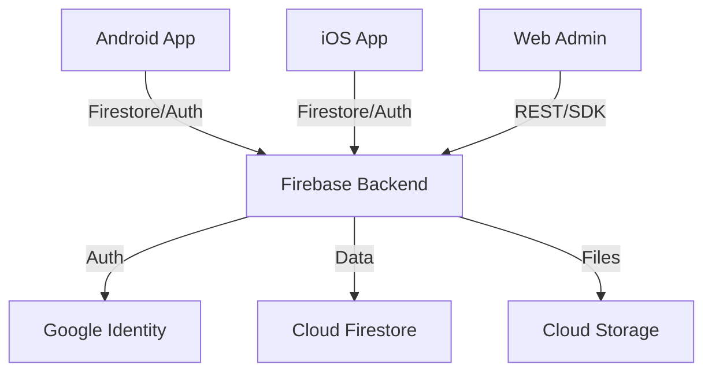

# Welcome to Call Tracker

**Call Tracker** is a comprehensive production-ready system for logging and managing call-related tasks. It allows users to track phone calls, associate them with tasks, and sync data across devices.

## 📱 Supported Platforms

- **Android**: Native app built with Kotlin & Jetpack Compose.
- **iOS**: Native app built with Swift & SwiftUI.
- **Web**: Admin and user dashboard (React).

## 🏗 High-Level Architecture

The system operates as a **cloud-synced monorepo** where the backend (Firebase) serves as the source of truth.

## 🛠 Tech Stack Summary

| Component | Technology | Key Libs |
| :--- | :--- | :--- |
| **Android** | Kotlin | Jetpack Compose, Room, Hilt, Coil |
| **iOS** | Swift | SwiftUI, XcodeGen, Combine |
| **Backend** | Firebase | Auth, Firestore, Functions, Storage |
| **CI/CD** | GitHub Actions | Fastlane (Release), Gradle, xcodebuild |
